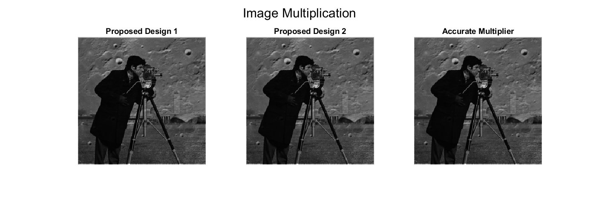
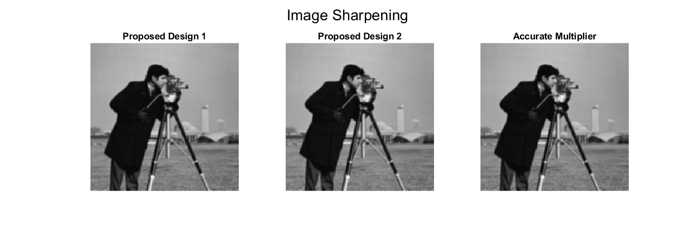

# Energy Efficient Approximate Multiplier for Image Processing

This project implements the research paper:

**"Energy Efficient Approximate Multiplier for Image Processing Applications"**
Chakraborty et al., *Results in Engineering (2025)*

---

## 🚀 Overview

This project focuses on designing and evaluating **approximate 4:2 compressors** and integrating them into an **8×8 Dadda multiplier** for:

* Reduced **power consumption**
* Lower **delay**
* Efficient **image processing**

The implementation reproduces:

* ✔ Accuracy Metrics (Table 4)
* ✔ MSSIM Image Quality (Table 6)
* ✔ Image Processing Outputs (Figure 8)

---

## 🧠 Key Concepts

* Approximate Computing
* 4:2 Compressors
* Dadda Multiplier Architecture

### Error Metrics:

* Error Rate (ER)
* Mean Error Distance (MED)
* Mean Relative Error Distance (MRED)
* Normalized Error Distance (NED)

### Image Quality Metric:

* MSSIM (Mean Structural Similarity Index)

---

## 📁 Project Structure

### 🔹 Core Modules

* `input_reorder.m` – Input reordering circuit
* `exact_compressor.m` – Accurate 4:2 compressor
* `compressor_proposed1.m` – Proposed Design 1
* `compressor_proposed2.m` – Proposed Design 2
* `literature_compressors.m` – Existing designs
* `approx_dadda_8x8.m` – Full multiplier

---

### 🔹 Evaluation Modules

* `compute_accuracy_metrics.m` – Table 4 metrics
* `compute_mssim.m` – MSSIM computation
* `image_convolve_approx.m` – Approx convolution
* `image_multiply_approx.m` – Approx multiplication
* `image_convolve_exact.m` – Ground truth

---

### 🔹 Kernels

* `get_smooth_kernel.m` – Smoothing kernel
* `get_sharp_kernel.m` – Sharpening kernel

---

### 🔹 Scripts

* `test_compressors.m` – Unit testing
* `main_run_all.m` – Full experiment
* `plot_results.m` – Visualization

---

## ⚙️ Requirements

* MATLAB (R2020 or later)
* Image Processing Toolbox

---

## ▶️ How to Run

```matlab
% Step 1: Run tests
test_compressors

% Step 2: Run full experiment
main_run_all

% Step 3: Plot results
plot_results(acc_results, img_results)
```

---

## 📊 Results

### 🔹 Table 4 – Accuracy Metrics

| Design            | ER (%) | AOC   | MED    | MRED   | NED     |
| ----------------- | ------ | ----- | ------ | ------ | ------- |
| Proposed Design 1 | 33.07  | 43861 | 47.90  | 0.0054 | 0.0007  |
| Proposed Design 2 | 78.15  | 14322 | 134.45 | 0.0248 | -0.0020 |
| Fang et al.       | 4.23   | 62762 | 16.78  | 0.0013 | 0.0003  |
| Odugu et al.      | 93.35  | 4355  | 179.73 | 0.0458 | 0.0006  |
| Krishna et al.    | 33.07  | 43861 | 43.01  | 0.0050 | 0.0007  |
| Rafiee et al.     | 96.85  | 2060  | 147.78 | 0.0489 | 0.0008  |
| Edavoor et al.    | 84.84  | 9935  | 193.53 | 0.0355 | 0.0028  |
| Gorantla et al.   | 92.67  | 4804  | 184.30 | 0.0454 | 0.0024  |
| Reddy et al.      | 93.21  | 4453  | 142.20 | 0.0408 | 0.0012  |
| Ha-Lee et al.     | 91.89  | 5312  | 192.00 | 0.0455 | 0.0030  |
| Momeni et al.     | 96.02  | 2611  | 297.50 | 0.0649 | 0.0046  |

---

### 🔹 Table 6 – MSSIM

| Design            | Multiplication | Smoothing | Sharpening |
| ----------------- | -------------- | --------- | ---------- |
| Proposed Design 1 | 0.9997         | 0.9976    | 0.9981     |
| Proposed Design 2 | 0.9958         | 0.9962    | 0.9967     |
| Fang et al.       | 0.9999         | 0.9974    | 0.9977     |
| Odugu et al.      | 0.9890         | 0.9928    | 0.9966     |
| Krishna et al.    | 0.9997         | 0.9979    | 0.9983     |
| Rafiee et al.     | 0.9883         | 0.9950    | 0.9973     |
| Edavoor et al.    | 0.9957         | 0.9923    | 0.9969     |
| Gorantla et al.   | 0.9959         | 0.9901    | 0.9948     |
| Reddy et al.      | 0.9956         | 0.9919    | 0.9967     |
| Ha-Lee et al.     | 0.9978         | 0.9859    | 0.9957     |

---

## 🖼️ Output Results (Figure 8)

### 🔹 Image Multiplication



---

### 🔹 Image Smoothing


---

### 🔹 Image Sharpening



---

## 🖼️ Combined View

| Multiplication                                 | Smoothing                                 | Sharpening                                 |
| ---------------------------------------------- | ----------------------------------------- | ------------------------------------------ |
|  |  |  |

---

## ⚡ Key Insights

* **Proposed Design 1**

  * Higher accuracy
  * Better image quality (higher MSSIM)

* **Proposed Design 2**

  * Lower hardware complexity
  * More power-efficient

👉 Trade-off: **Accuracy vs Efficiency**

---

## ⏱️ Runtime

| Task            | Time      |
| --------------- | --------- |
| Unit Testing    | < 1 min   |
| Full Simulation | 15–30 min |

---

## 🧩 Working Principle

1. Generate partial products
2. Apply Dadda reduction
3. Use approximate compressors in LSB
4. Use exact compressors in MSB
5. Final addition via ripple carry adder

---

## 📌 Notes

* If `crater.png` is missing → `moon.tif` is used
* Keep all `.m` files in one folder
* Minor variation in results is normal

---

## 📚 Reference

Chakraborty et al.
**Energy Efficient Approximate Multiplier for Image Processing Applications**
*Results in Engineering, 2025*

---

## 👨‍💻 Author

Naresh Godara, Siddharth Khandelwal, Anushka Mishra, Rishu Kumar

---

## ⭐ Future Work

* FPGA implementation
* Power-delay analysis
* AI/ML acceleration using approximate multipliers

---
